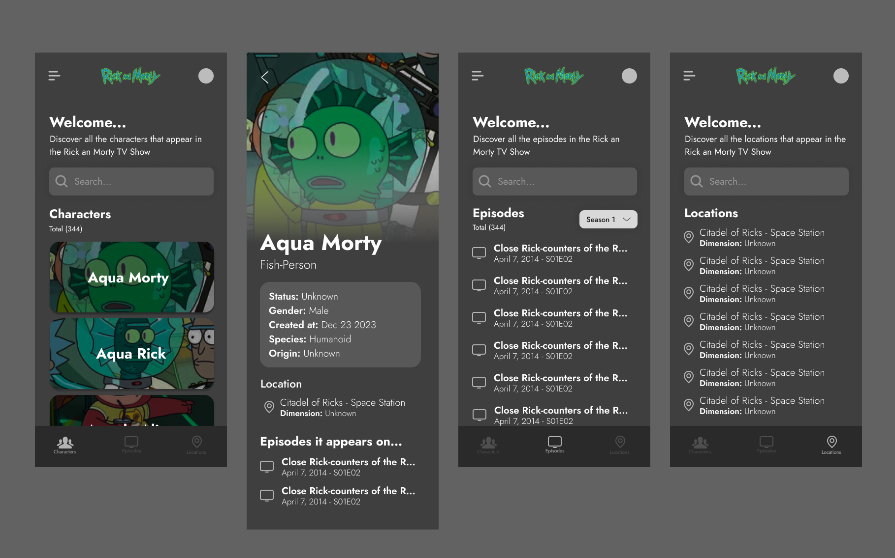

# GetX and GraphQL Tech Test in Flutter

This is a test project for the usage of graphql and getx in the build process of an app in fluttter.

## Getting Started

To run the project you must have flutter installed along with the SDK, also you must clone this repository and run the app ethier on a physical device or an android emulator or IOS simulator as well.

## UI Proposal

This UI is based on the UI inspiration that was given in the test specifications, the app's UI is built based on the information and data retrieved from the [Rick and Morty's API](https://rickandmortyapi.com) using the GraphQL approach for the API server calls, retrieveing information about the characters, episodes, and locations from the TV show.
